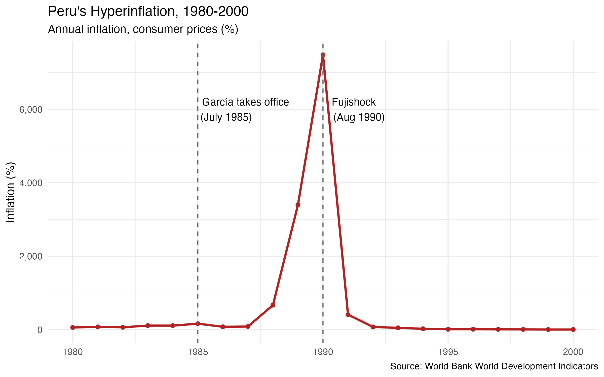

# latam-corruption-growth
Analysis of Peru's 1980s hyperinflation, 1990s recovery, and the role of corruption, using World Bank data in R.

## Question
How did Peru go from hyperinflation in the late 1980s to one of Latin America's
most stable economies, and how does corruption relate to economic growth across
the region?

## Data
- World Bank World Development Indicators (inflation, GDP growth, GDP per capita)
- World Bank Worldwide Governance Indicators (Control of Corruption)

## Tools
R

## Key Finding So Far
Peru's inflation peaked at **7,482% in 1990**, meaning prices rose about
76x in a single year (roughly 43% per month). After the August 1990
"Fujishock" stabilization program, inflation fell to 410% in 1991 and
about 11% by 1995.

## Status
In progress: next step is comparing Peru with Mexico, Colombia, Chile, and Brazil.
