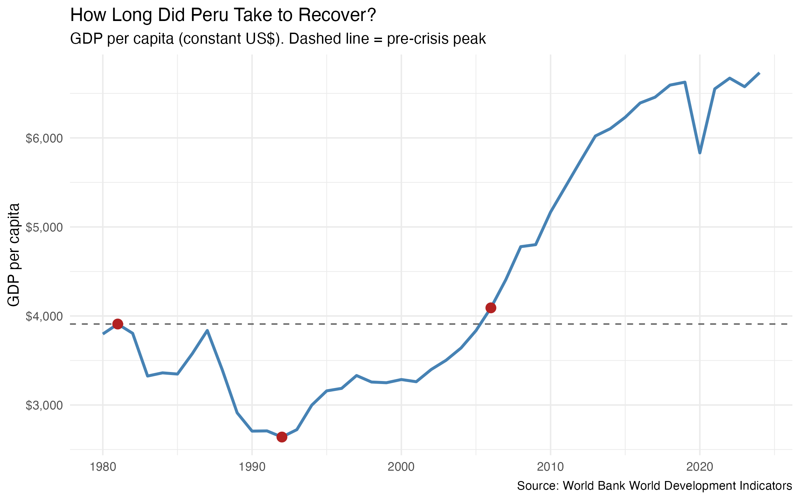
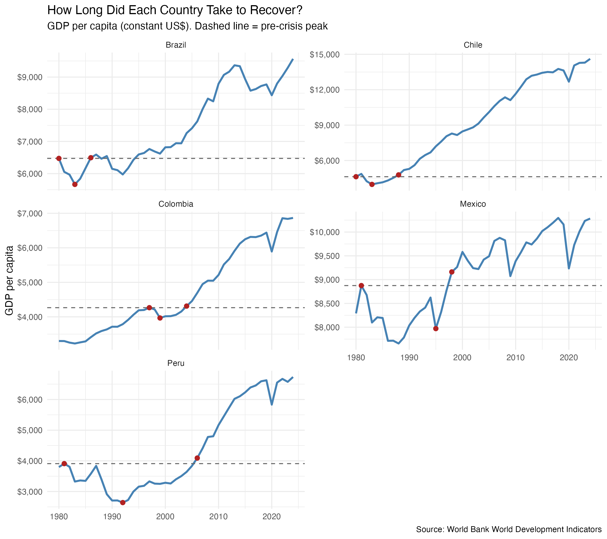
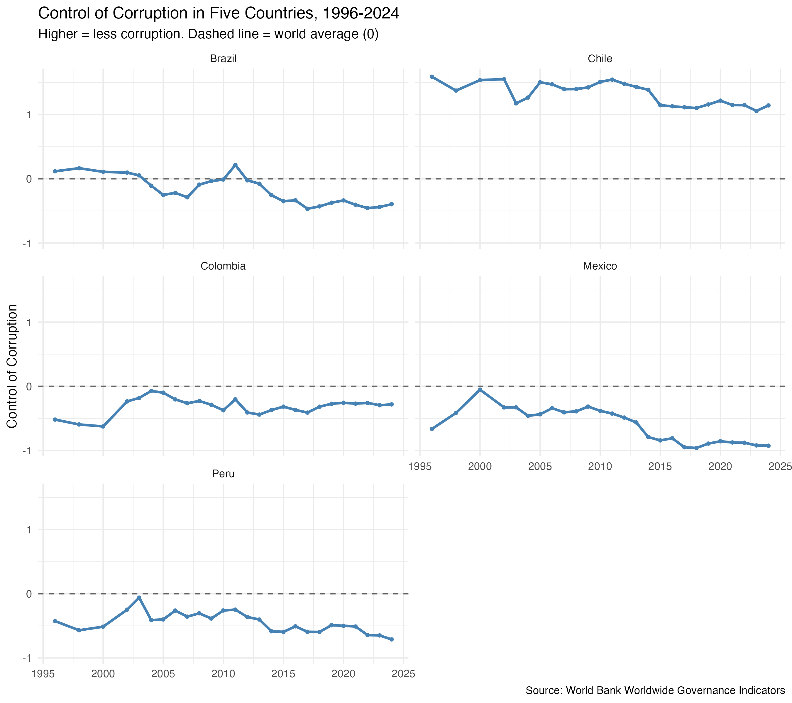

# latam-corruption-growth
Analysis of Peru's 1980s hyperinflation, 1990s recovery, and the role of corruption, using World Bank data in R.

## Question
How did Peru go from hyperinflation in the late 1980s to one of Latin America's
most stable economies, and how does corruption relate to economic growth across
the region?

## Data
- World Bank World Development Indicators (inflation, GDP growth, GDP per capita)
- World Bank Worldwide Governance Indicators (Control of Corruption)

## Tools
R

## The Hyperinflation
Peru's inflation peaked at **7,482% in 1990**, meaning prices rose about
76x in a single year (roughly 43% per month). After the August 1990
"Fujishock" stabilization program, inflation fell to 410% in 1991 and
about 11% by 1995.

## How Long Did Recovery Take?
Peru's GDP per capita (inflation-adjusted) peaked at $3,910 in 1981, fell
32.5% to $2,640 by 1992, and didn't return to its pre-crisis level until
2006, **25 years later**. Notably, the decline began in the early 1980s,
before the hyperinflation, which suggests the region-wide debt crisis
also played a role.

## How Does Peru Compare?

Each country had its crisis at a different time, so each one gets its own crisis window. Peru's collapse was by far the deepest and longest: GDP per capita fell 32.5% and took 25 years to recover. Chile, Colombia and Brazil got back to their pre-crisis level in 6 to 8 years. Mexico's 17 years is partly misleading: its GDP per capita was still below its 1981 peak when the 1994 Tequila crisis hit, so that number also includes the 1980s debt crisis.

## How Corrupt Is Each Country?

The World Bank's Control of Corruption score runs from about -2.5 (most corrupt) to +2.5 (least corrupt), with 0 as the world average. Chile is the only one of the five above average, though its score has slipped from 1.59 in 1996 to 1.14 in 2024. Mexico, Peru and Brazil have all gotten worse since the early 2010s: Mexico fell to -0.93, Peru to -0.71 and Brazil from slightly above average to -0.40. Colombia is the exception, improving slowly from -0.52 to -0.28.

## Status
In progress: next step is comparing corruption scores with GDP growth.
